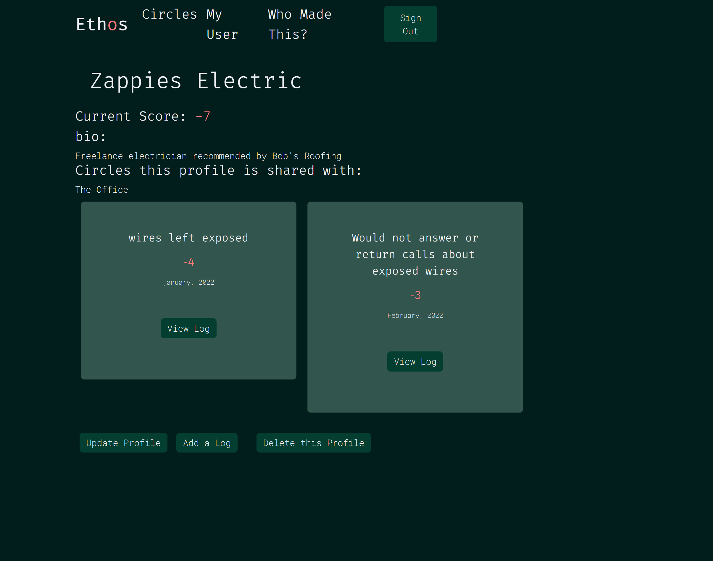
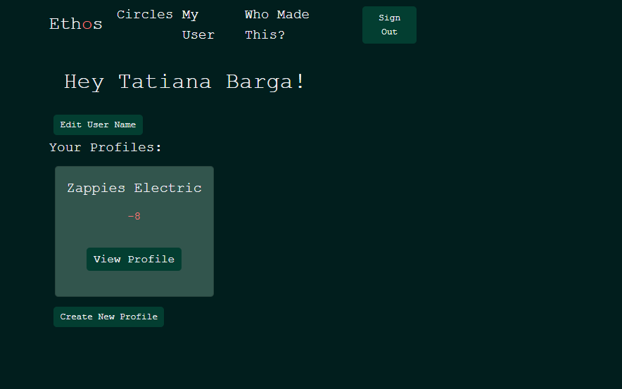
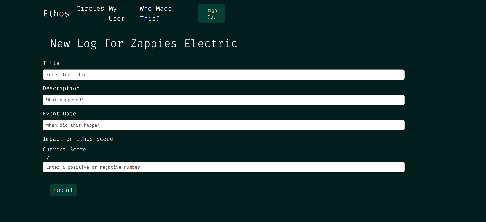
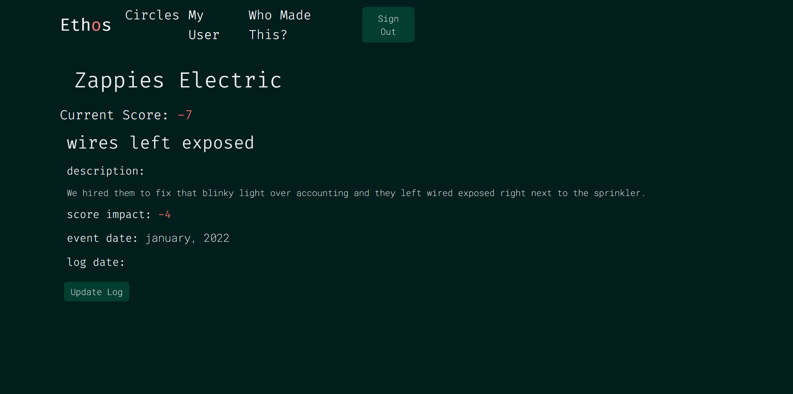
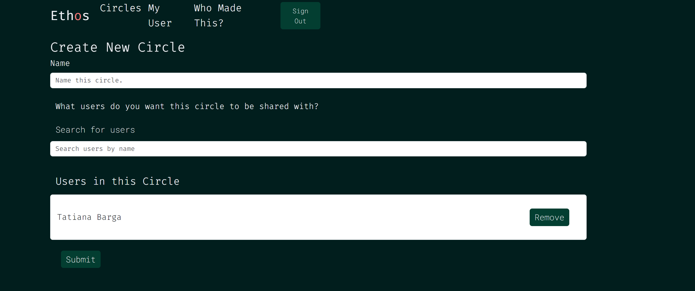
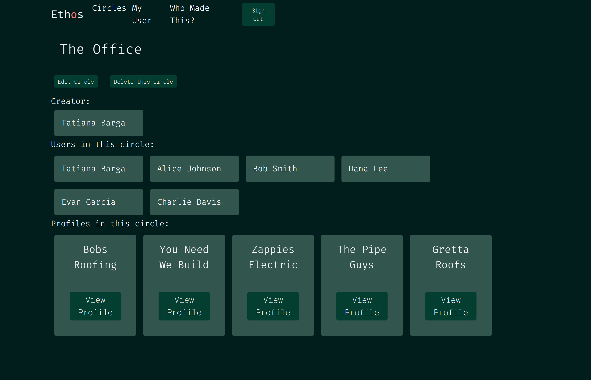
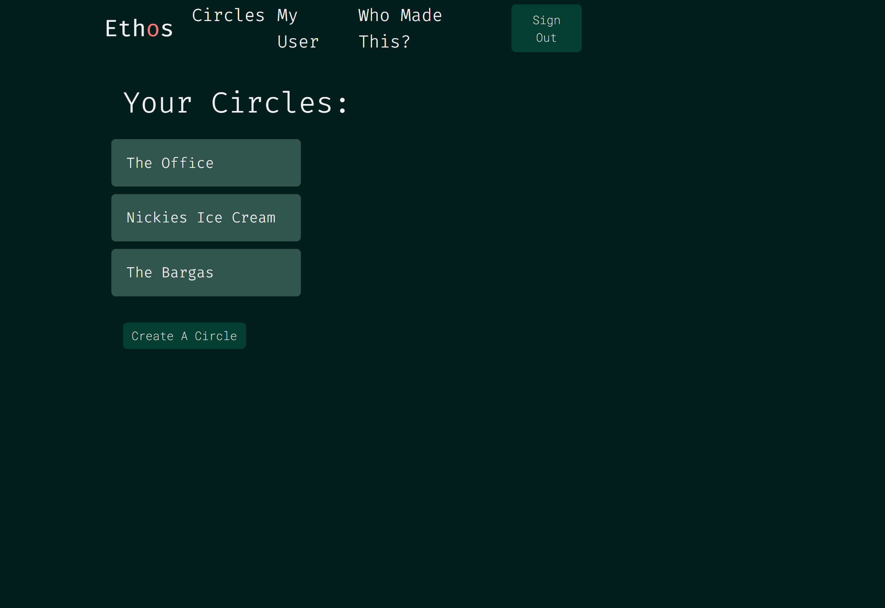

# Ethos Server-Side Repository

## Overview

**Ethos** is a full-stack web application designed to track and evaluate experiences and opinions related to corporations, politicians, contractors, individuals, and more. It provides users with a versatile platform to manage and share feedback, aiding in informed decision-making and transparency.


## Features

- **Profile Management**: Create and manage profiles for entities such as contractors, corporations, and individuals.


  
- **Ethos Score**: Each profile includes an Ethos Score updated based on user feedback.


- **Experience Logging**: Document experiences with profiles, including descriptions, dates, and score impacts.



- **Circles**: Organize profiles into 'circles,' allowing shared access and collaboration on profiles and logs.





## User Description
- Use Case: Corporate users leverage Ethos to track and evaluate their experiences with contractors and service providers. By documenting and reviewing feedback, they can make informed decisions on whether to continue working with these entities or select new ones.
- Use Case: Individual users utilize Ethos to monitor and assess the actions and policies of corporations and politicians. By keeping detailed records of their experiences and observations, they can better decide which organizations and leaders align with their values and which ones to avoid. This empowers them to support ethical and responsible entities, contributing to more informed civic and consumer choices.


## Links and Resources
- [deployed project](https://ethos-client.netlify.app)
- [deployed backend](https://ethosapi-182a09cd49d6.herokuapp.com/)
- [project board](https://github.com/users/tatianabarga/projects/5/views/1?pane=issue&itemId=70796528)
- [postman documentation](https://documenter.getpostman.com/view/30237001/2sAXjJ4s76)
- [ERD](https://drawsql.app/teams/tatiana-bargas-team/diagrams/ethos)
- [Wireframe](https://www.figma.com/design/OV8zg11xjindtsnKR8iW9k/Ethos?node-id=0-1&t=LpJ6Ndp5CZLbxgIk-0)
- [Client-Side repository](https://github.com/tatianabarga/ethos-client)


## Tech Stack
- Python
- DRF


## Contributors
- [Tatiana Barga](https://github.com/tatianabarga)

## Getting Started

1. **Clone the Repository**:
   ```bash
   git clone https://github.com/yourusername/ethos-server.git
   ```

2. **Set Up a Virtual Environment**:
   ```bash
   pipenv shell
   ```

3. **Install these third-party packages for use in your project**:

    ```bash
   pipenv install django=='4.1.3' autopep8=='2.0.0' pylint=='2.15.5' djangorestframework=='3.14.0' django-cors-headers=='3.13.0' pylint-django=='2.5.3'
    ```

5. **Activate the Virtual Environment**:
   - On Windows:
     ```bash
     venv\Scripts\activate
     ```
   - On macOS/Linux:
     ```bash
     source venv/bin/activate
     ```

6. **Configuration**:
   Create a `.env` file in the root directory and configure the necessary environment variables. 

7. **Run the Server**:
   ```bash
   python manage.py runserver
   ```

8. **Database Migration**:
   Set up the database by running the migration scripts:
   ```bash
   python manage.py migrate
   ```


